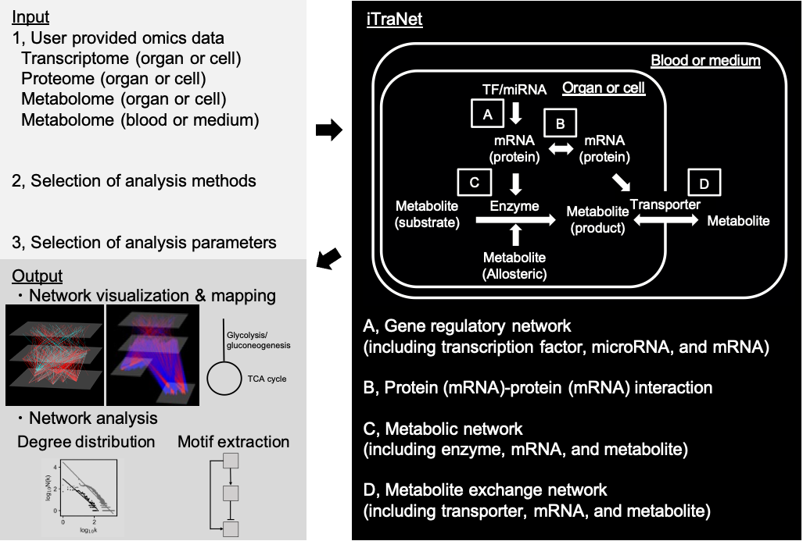

# iTraNet: A Web-Based Platform for integrated Trans-Omics Network Visualization and Analysis

iTraNet is an interactive web application that visualizes and analyzes trans-omics networks involving four major types of networks: gene regulatory networks; protein-protein interactions; metabolic networks; and metabolite exchange networks.

iTraNet requires transcriptome, proteome, and/or metabolome data, as input (left, top panel).

iTraNet estimates transcription factors (TFs), microRNAs (miRNAs), proteins, mRNAs, metabolic enzymes, and transporters associated with the uploaded omics data. iTraNet then visualizes and analyzes four distinct categories of biological networks: (A) gene regulatory networks (including TF, miRNA, and mRNA); (B) protein (mRNA)–protein (mRNA) interactions; (C) metabolic networks (including enzyme, mRNA, and metabolite); and (D) metabolite exchange networks (including transporter, mRNA, and metabolite) (right panel).

iTraNet outputs a comprehensive visualization of the four types of biological networks, maps for each metabolic pathway, and results of the network analyses, exemplified by degree distributions and motif extraction (left, bottom panel).

[`iTraNet`](https://itranet.streamlit.app/) is hosted on the Streamlit cloud.
The web application is provided with limited memory, which might lead to slower access and computations. For faster and more stable calculations, users can download the code from this GitHub repository and run iTraNet on a local machine.
Use the commend below to launch the web application on a local machine.
    
    streamlit run main.py
    
